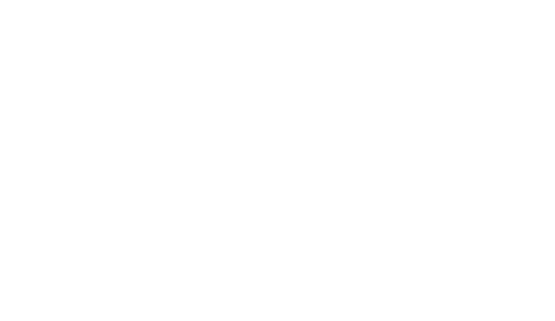

# Refundable Token

### A no intermediaries time-ensurance eletronic refund system

Everytime a transaction is sent in a cryptocurrency, it has to be approved, validated and mined. The time taken to realize this operation is very variable, as observed in many blockchains. The lack of precision in time to a transaction suceeds characterize a flaw on the model. The reason that this is a flaw it’s that real world needs precision.

Transactions should be reversible for a period of time. The 'time' is defined by the actual block number. A minimal refund block number should be assigned to every address and every transaction must have at least the value of it. The minimal refund block must be able to be changed. A debt check should occur, ensuring security for refundable amounts, and preveting "Send Before Refund" attack. All of this must be stored in a central storage array. That eletronic smart contract guarantees one thing: a no intermediaries time-ensured eletronic refund system.

## The concept behind

Consider the following case:

Rose needs to pay the rent of her’s house. The rent must be paid every month on the 24th day, and in case of lack of payment, fines will be applied. Rose, by using cryptocurrency, has two alternatives to pay on the right day. 
- The first one is Rose actively stay on the computer and perform the transaction on the right day, and the second is delegate it to someone else. The first alternative is impracticable, since Rose is not always available. The second needs trust.
- And both the first and the second method have the flaw presented earlier: in case a big demand arise, the Rose transaction will be delayed and can overpass the 24th day limit. That proves the fragility of the actual system.

The key element for solving this problem and many others, such as tokens sent to a wrong address, addresses that had their private keys stolen, without having an intermediary is to have reversible transactions by using smart contract token. The term "time-ensurance", defined by "something happen in the exact time it's supposed to" is obsolete in cryptocurrency. However, by using the following system, the flaw is fixed, since transactions just became unrevertible precisely after a specific block number is reached.

## Implementation

- This solution is a proof of concept smart contract implemented in Solidity language in Ethereum Virtual Machine (EVM) as an ERC20 Token.

- Testing is implemented using Mocha and Truffle suite by using common Javascript. I plan to update it soon to Typescript.

### Prerequisites

Requirements for the software and other tools to build and test

- [Truffle](https://archive.trufflesuite.com/)
- [Mocha](https://mochajs.org/)
- [Node](https://nodejs.org/pt)
- [Solidity](https://soliditylang.org/)

## Running the tests

A test file can be found in RFT.test.js file. This file contains commom flaws in Solidity.
> npm test

## Authors

  - **Labelle Moon** - Hugo Cardoso (hugo.card@usp.br) -
    [LabelleMoon](https://github.com/BelleMoon)

## License

This project is licensed under the
MIT License - see the [LICENSE](LICENSE) file for
details.

## Acknowledgments

  - See "Refundable Token.pdf" for more technical insights. 
